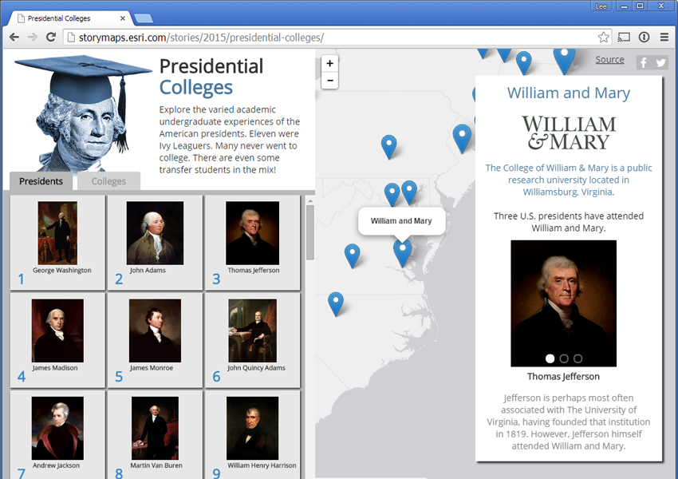
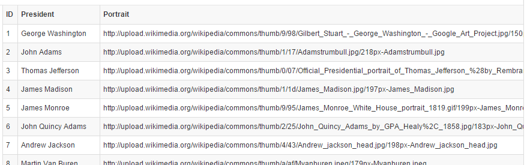
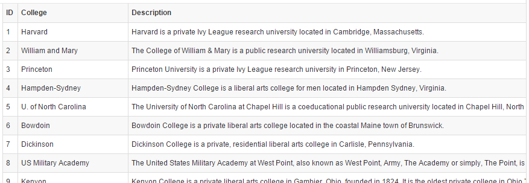
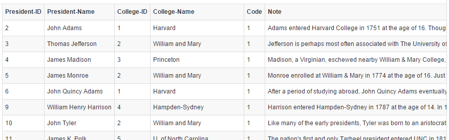

Presidential Colleges
=====================

This github repo contains the source code for the Presidential Colleges Story Map.  The Presidential Colleges app maps the colleges attended by U.S. presidents and shows which president went where.

[View live app here](http://storymaps.esri.com/stories/2015/presidential-colleges/)

## Data Relationships

The nature of the data requires the application to handle both one-to-many and many-to-one relationships between presidents and colleges.  In other words:

* A college may boast multiple presidential alumni.
* A president may have attended more than one college (the most recent example being President Obama, who transferred from Occidental College to Columbia University).

In order to support the presentation and query of these relationships, the data set is stored in its most normalized form.  This results in three separate CSV's:

One representing **presidents**:

One representing **colleges**:

And, finally, one representing the **relationships** between presidents and colleges:

Note that the application only really uses the College-ID and President-ID in numerical form.  We have included the President-Name and College-Name just to make the table more readable.

Incidentally, we used Microsoft Access to build and maintain the database (Access has nice tools for managing relationships).  We then exported SQL queries as csv's to format the data as more easily consumable by the application.

